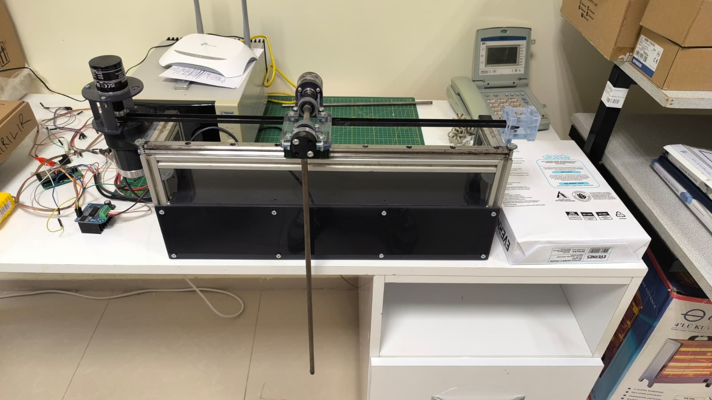
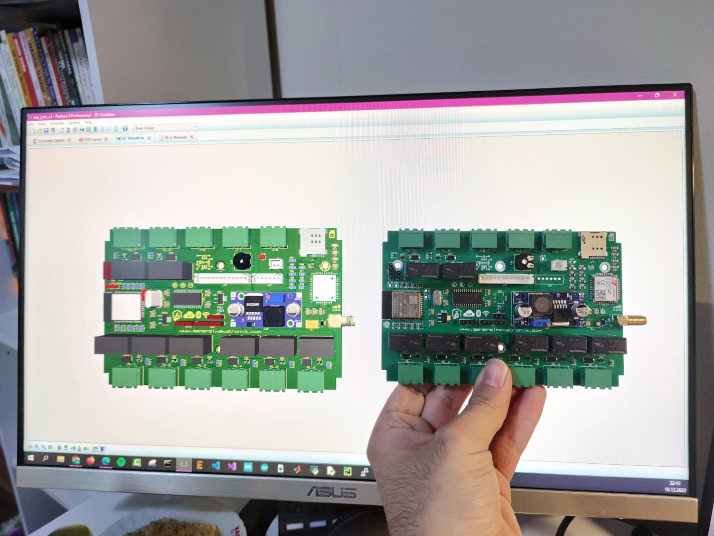

# Comparative Simulation Analysis of Underactuated Robotic Mechanisms

This repository contains the official Python simulation framework for the ISMSIT 2026 submission: **"Comparative Simulation Analysis and Control Benchmarking of Underactuated Robotic Mechanisms."**

It provides a lightweight, non-proprietary computational suite to benchmark nonlinear control strategies across three canonical underactuated systems, serving as the algorithmic precursor for a 32-bit ESP32-based physical deployment.

## Included Benchmarks
1. **Cart-Pole:** Passivity-based energy shaping with local LQR stabilization.
2. **Ball and Beam:** Recursive integrator backstepping for cascaded zero-dynamics.
3. **Planar Bicopter:** Cascaded PD-Lyapunov regulation for aerodynamic differential thrust.

## Installation and Usage
Ensure you have Python 3.8+ installed, then install the required dependencies:

bash
pip install -r requirements.txt

Run the master simulation script to generate the transient response and control effort vectors:

bash
python simulation_benchmark.py

## Towards Physical Deployment: Hardware-in-the-Loop (HIL)
While this repository focuses on the continuous-time simulation baseline, the control architectures are explicitly bounded by the physical saturation constraints of our ongoing hardware development. 

The algorithms are currently being migrated to a custom **ESP32-based "gm-controller"** board for real-time FreeRTOS execution. Below is the completed physical Cart-Pole testbed and the custom embedded hardware that will bridge this simulation to reality in our future work:

*(Reviewer Note: Physical deployment and HIL validation are slated for subsequent publications evaluating fixed-point execution and Control Barrier Functions).*

